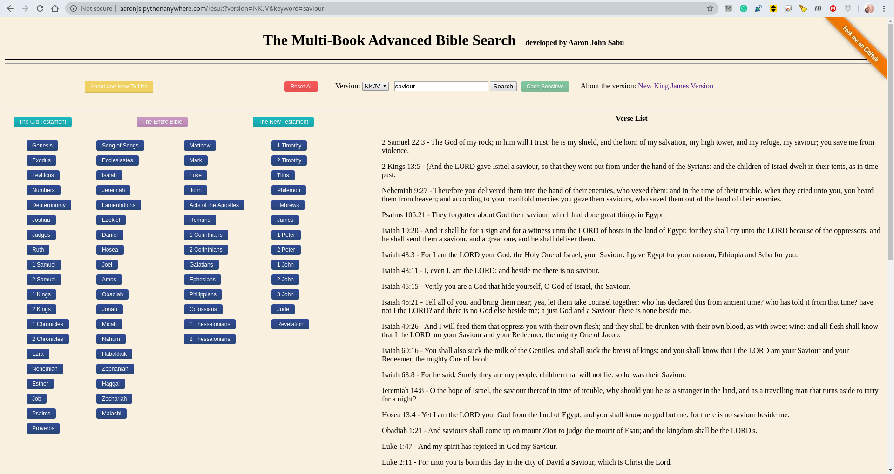

# The Multi-Book Advanced Bible Search

### Table of Contents

- [Introduction](#introduction)
- [For the Developer...](#for-the-developer)
  * [Useful Links](#useful-links)
  * [Installation of Necessary Packages](#installation-of-necessary-packages)
- [Contributors](#contributors)
- [Possible additions and modifications](#possible-additions-and-modifications)
- [License](#license)

### Introduction

This web application is one which provides the user the ability to search for a word sequence, case-sensitive or case-insensitive, in a specified set of books of the Holy Bible.  
The web application has been hosted on [this platform](http://aaronjs.pythonanywhere.com/)

***
### For the Developer...

#### Useful Links

* [Jinja Template and Syntax](https://jinja.palletsprojects.com/en/2.11.x/templates/)

#### Installation of Necessary Packages
(Python 3.6.9 has been used for the development of the web app)

    sudo apt install make  
    make install  
    make

***
### Contributors

Formatting suggestions have been provided by my dad, [Sabu John](https://www.facebook.com/sabu.john.104) and my mom, Jessy Sabu John, alongside several other users.  
Support for Flask has been provided extensively by [@hbhoyar](https://github.com/hbhoyar)  
The databases have been parsed from the SQL databases provided by [@scrollmapper](https://github.com/scrollmapper)

***
### Possible additions and modifications
##### You are most welcome to contribute for adding to this list (issues) and for removing from this list (pull requests)

* Making the web application completely compatible for mobile devices; i.e., devices without $$1920\times 1080$$ resolution
* Addition of an Search ORing capability; i.e., to search for any of the several keywords of those provided by the user
* Addition of copyrighted versions such as ESV, NIV and BSI Indian versions (which also require Indian language keyboards)
* Removal of PythonAnywhere cache when opened by a new user (presently, an entry by one user may be displayed as the entry in the browser of another user): Storing search keyword, version, case-sensitivity, selected books and rows on the browser of the user rather than on the webpage hosting platform (PythonAnywhere): Refer to [this StackOverflow answer](https://stackoverflow.com/a/16206342/6539635)
* More styling features and a logo for mBAB
* Pagination for verses as an option to the user (not everyone wants pagination but some may prefer it for better rendering of the verses
* Subdivision of the testaments such as Law, History, Gospels, etc. (conflicting suggestions - not to be pursued at the moment)
* Highlighting the search keyword in the results (DONE)
* Display of the number of matching verses (DONE)

***
### License

This project has been licensed under 
